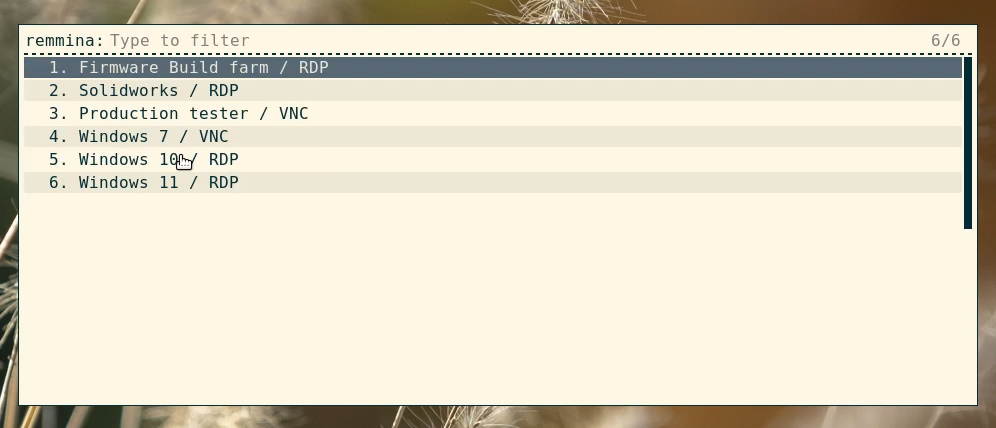

# Remmina profiles menu for Rofi
### Version 1.0

* [Installation](#Installation)
* [Usage](#Usage)
* [License](#License)

Custom modi script to provide a menu to open saved [Remmina](https://remmina.org/) profiles in [Rofi](https://github.com/davatorium/rofi).

Useful if you keep connecting to remote machines and you're tired of bringing up the main Remmina window to select a profile each time you need a new connection.

## Installation

- Install Python3 if it isn't installed on your system already.

- Install the script in the Rofi configuration directory:
  <pre>
  mkdir -p ~/.config/rofi/
  cp remmina_profiles.py ~/.config/rofi/
  chmod +x ~/.config/rofi/remmina_profiles.py</pre>

- If Remmina isn't installed at `/usr/bin/remmina` on your system, or if your main Remmina configuration file isn't at `~/.config/remmina/remmina.pref`, edit the preferences in `~/.config/rofi/remmina_profiles.py`

- If you use a Rofi configuration file (i.e. `~/.config/rofi/config.rasi`), add the custom Remmina mode to the `modi` line:
  <pre>
  configuration {
      <i>[...]</i>
      modi: "drun,run,window,ssh,<b>remmina:~/.config/rofi/remmina_profiles.py"</b>;
      <i></n>[...]</i>
  }</pre>

- If you don't use a Rofi configuration file, pass the new modi as a command line parameters - for example in your i3 configuration file:
  <pre>
  bindcode $mod+40 exec "rofi -modi drun,run,window,ssh,<b>remmina:~/.config/rofi/remmina_profiles.py</b> -show drun"</pre>

## Usage

- Start Rofi.
- Switch modes using `Ctrl-Tab` until you get to the **remmina** mode: all your saved Remmina profiles should show up in the list.
- Select the profile to open as you would from the main Remmina window.

## License

MIT
